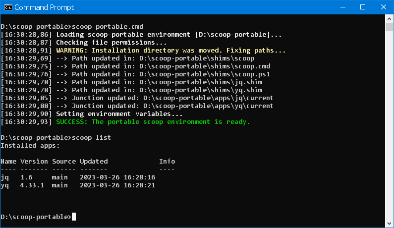
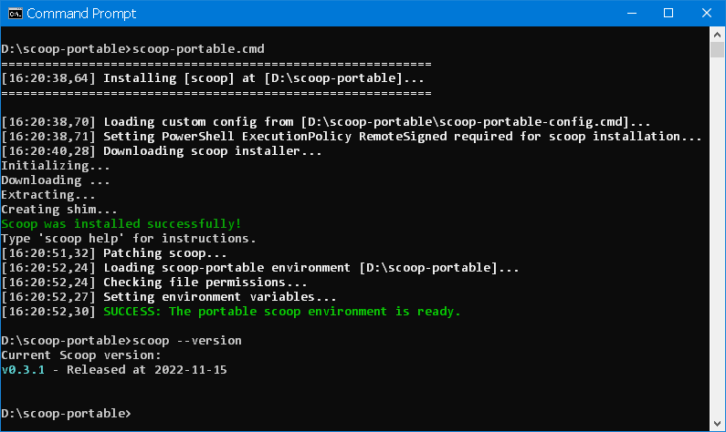

# scoop-portable

[](https://github.com/vegardit/scoop-portable/actions?query=workflow%3A%22Build%22)
[](#license)

1. [What is it?](#what-is-it)
1. [License](#license)


## <a name="what-is-it"></a>What is it?

> **NOTE:** This project is _work-in-progress_, while it works fine with the apps we use, it may not yet work as expected with all apps installable via scoop. Pull requests are welcome!

**scoop-portable** is an attempt to provide a true portable, "non-invasive" environment of the [scoop](https://scoop.sh/) command-line installer for the Windows Command Prompt.

For ease of distribution/use, it is implemented as a single self-contained Windows batch file.

Advantages over using "regular" scoop:
- the scoop directory can be moved and live on an USB stick/external disk
- installing/removing/resetting apps does not require restarting the command prompt
- switching between different Java versions works seamlessly for the current and future sessions (https://github.com/ScoopInstaller/Java/wiki#switching-javas)
- when installing the git package, all GNU commands at `apps\git\usr\bin` are made available on PATH, i.e. no need to install additional packages like `coreutils`, `tar`, `vim`

Limitations:
- **scoop-portable** only works for the **Windows Command Prompt** and not for **PowerShell sessions**,
  however using **scoop-portable** together with [clink](https://github.com/chrisant996/clink) (also installable via scoop) gives a great command line experience and productivity.
- since the project strives for a purely portable environment, the following features/behaviours of **scoop** are disabled:
  - installation of global apps is disabled.
  - creation of start-menu entries.
  - permanent changes to the global PATH variable or setting of permanent environment variables by **scoop** is prevented.




## <a name="install"></a>Installation

1. Get a copy of the batch file using one of these ways:
   * Using old-school **Copy & Paste**:
      1. Create a local **empty** directory where scoop shall be installed, e.g. `C:\apps\scoop-portable`
      1. Download [scoop-portable.cmd](scoop-portable.cmd) file into that directory.
   * Using **Git**:
      1. Clone the project into a local directory, e.g.
         ```batch
         git clone https://github.com/vegardit/scoop-portable C:\apps\scoop-portable
         ```
2. (Optional) Customize the installation by creating a file called `scoop-portable-config.cmd` in the same directory.
    See [scoop-portable-config.example.cmd](scoop-portable-config.example.cmd) as an example.
3. Make sure the line break type is set to Windows (CR LF) via programs such as Notepad++ to prevent errors such as `The syntax of the command is incorrect`.
4. Now execute `scoop-portable.cmd`.
   - On the first execution, scoop and the selected packages will be installed in a `scoop` sub-directory and the scoop environment is initialized.




## <a name="usage"></a>Usage

Once installed, subsequent executions of `scoop-portable.cmd` load scoop environment:
 - either in the current command window if executed from the command line, or
 - a new command window is opened if executed via Windows Explorer or e.g. a Desktop shortcut.

An app installed in the `scoop-portable.cmd` can be launched from anywhere using: `scoop-portable.cmd <app> [app args]`

### Importing a Scoopfile

Use `scoop import <path-or-URL>` to import apps, buckets, and settings from a Scoopfile.
Files exported from a regular Scoop installation can include globally installed apps.
scoop-portable rejects a Scoopfile containing any such app before applying its settings, buckets, or apps.
The error message identifies the first global app in the file.

To import only the local apps, remove the global app entries from the Scoopfile and retry.
To install those apps in the portable environment instead, remove `Global install` from their `Info` fields,
keeping any other flags such as `64bit` or `Held package`.

### Upgrading and troubleshooting

#### Missing app settings after an upgrade

Scoop 0.6.0 renamed its installed app metadata files.
Older versions of scoop-portable could therefore miss app versions and environment settings.
Replace `scoop-portable.cmd` with the current version, load it, and run `scoop reset --all`
to rebuild the portable settings for installed apps.
Then load `scoop-portable.cmd` again to apply the restored settings.

If settings written by an app's installation hooks are still missing, run `scoop update --force <app>`,
replacing `<app>` with the affected app's name.
Then load `scoop-portable.cmd` again to apply the restored settings.

#### App settings contain an environment variable name

An older version of scoop-portable may have saved a reference to another environment variable
as literal text instead of using its value.
For example, Fork's `FORKGITINSTANCE` setting may contain `$env:GIT_INSTALL_ROOT`
instead of the directory of your Git installation.

Load `scoop-portable.cmd` so that settings from installed apps are available,
then run `scoop reset <app>` to recreate the affected app's settings.
For Fork, run `scoop reset fork` after installing Git in the portable environment.
This repair does not require reinstalling the app.

#### Gradle still uses an old directory

An older version of scoop-portable may have left a `GRADLE_USER_HOME` variable in your Windows user environment.
Gradle keeps an existing value, so forcing an update alone may still leave it using the old directory.

Check `GRADLE_USER_HOME` under **User variables** in Windows' **Environment Variables** dialog.
If you confirm that the value was left by this portable installation or its former location,
record it before removing it.
Leave values that you configured intentionally in place.

After removing the leftover variable, open a new Command Prompt and load `scoop-portable.cmd`.
Run `scoop update --force gradle`, then load `scoop-portable.cmd` again to apply the restored setting.

#### Errors while saving app settings

If Scoop reports that it could not save settings, first resolve the problem described in the error message,
such as a file access error.
Run the recovery commands below in a Command Prompt where you have loaded `scoop-portable.cmd`.

If the message mentions **hook settings**, retry the installation or update.
These settings are collected while the app's installation scripts run,
so `scoop reset <app>` cannot recreate them.

If the message mentions **manifest settings**, retry the operation that failed.
For a failed installation or update, Scoop still needs to finish its installation steps;
`scoop reset <app>` cannot complete them.
If the error occurred during a reset, retry that reset.

If retrying an update reports that the app is not installed or asks you to reinstall it,
run `scoop install <app>`.
Use the original bucket or manifest if you installed the app from a specific source.
Include any architecture option you selected for the original installation, such as `--arch 32bit`.
This can be necessary after an interrupted forced update.

If the message mentions **portable settings**, run `scoop reset <app>`.
This reapplies the settings declared by the app and combines them with its saved hook settings.
For a JDK, the reset also switches the active Java version to that JDK.

To rebuild portable settings for all installed apps,
use `scoop reset --all`, `scoop reset -a`, or `scoop reset *`.
These bulk resets preserve the JDK selection recorded by scoop-portable.

#### Errors while restoring the user PATH

During `scoop update`, an app's installer can change the Windows user PATH directly.
scoop-portable saves the original value before updating and restores it afterwards.
If saving fails, the update does not start.
Resolve the reported problem, such as an inaccessible temporary directory, before retrying.

If restoration fails, the error message names a retained snapshot file.
Keep that file and resolve the reported problem before restoring it.
Starting another update will not recover the original PATH, because it would save the already changed value.

To recover, run `powershell -NoProfile` from a Command Prompt where scoop-portable is loaded.
Then run the following commands and enter the snapshot's full path when prompted:

```powershell
. "$env:SCOOP\.portable\environment.ps1"
Restore-ScoopPortableUserPath (Read-Host 'Snapshot file')
```

`True` means the saved value was restored; `False` means it already matched.
If the command reports an error, resolve it before continuing.
After successful restoration, notify Windows of the change:

```powershell
. "$env:SCOOP\apps\scoop\current\lib\system.ps1"
Publish-EnvVar
```

You can then delete the snapshot file and run `exit` to leave PowerShell.
Existing command windows can still hold old values, as described below.

#### Stale values in an existing Command Prompt

An open Command Prompt can retain old environment values after an app's settings change or the app is removed.
Loading `scoop-portable.cmd` again does not necessarily clear those inherited values.
To start with a fresh environment, open a new Command Prompt from the Windows Start menu
and load `scoop-portable.cmd` there.


## <a name="license"></a>License

All files are released under the [Apache License 2.0](LICENSE.txt).

Individual files contain the following tag instead of the full license text:
```
SPDX-License-Identifier: Apache-2.0
```

This enables machine processing of license information based on the SPDX License Identifiers that are available here: https://spdx.org/licenses/.
